# Environment Setup

## 1. AWS Subnet Creation

The initial environment included a dedicated subnet for the deployment environment.

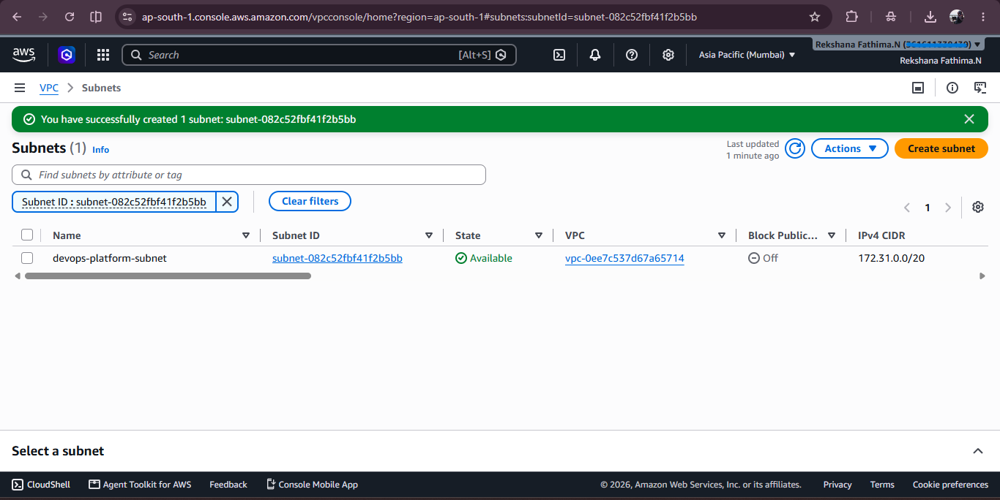

## 2. EC2 Instance

An Ubuntu EC2 instance was created to provide a cloud-based environment for the initial container and Kubernetes work.

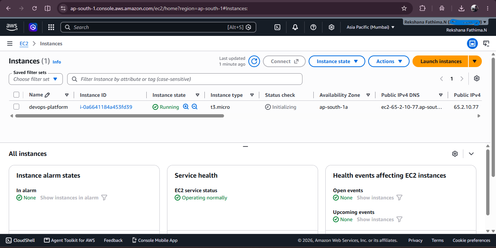

## 3. EC2 Instance Connect

EC2 Instance Connect was used to establish access to the instance.

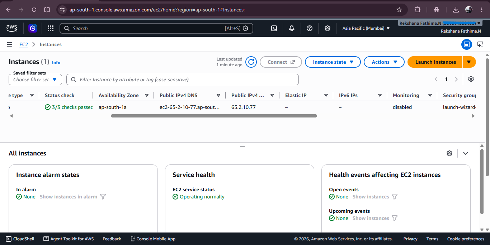

## 4. EC2 Terminal

The EC2 terminal was successfully accessed.

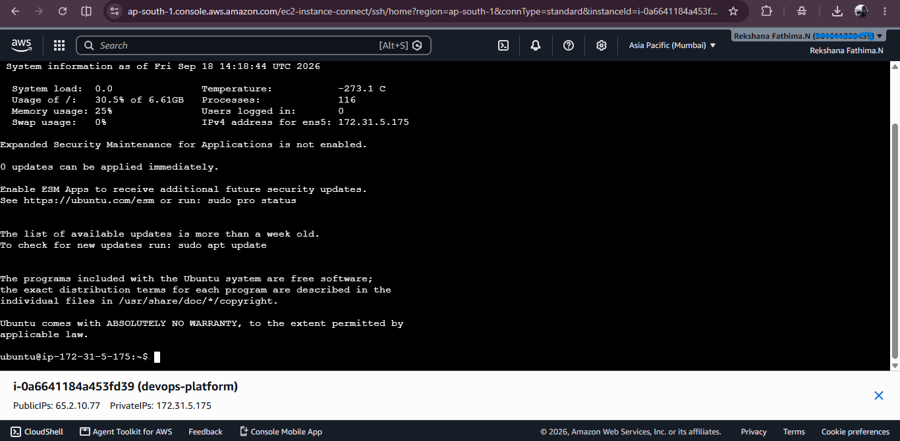

## 5. Docker Installation Test

Docker installation was verified using the Docker command-line interface.

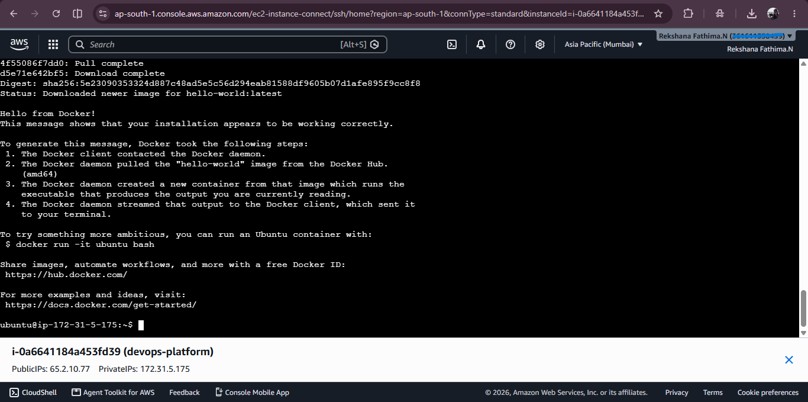

## 6. Docker Container

A Docker container was started successfully.

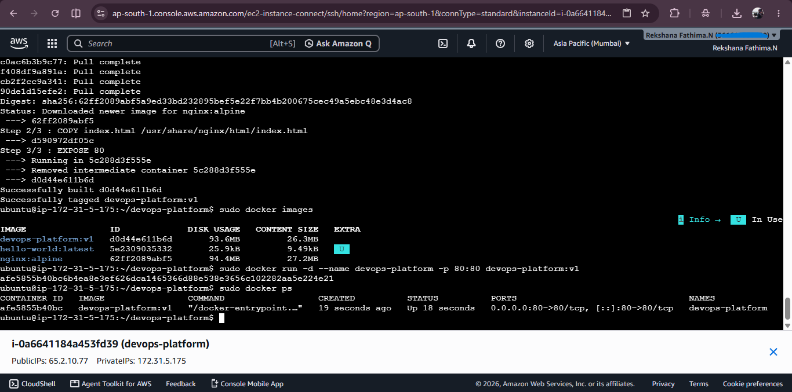

## 7. Container Application Test

The application running inside the container was tested.

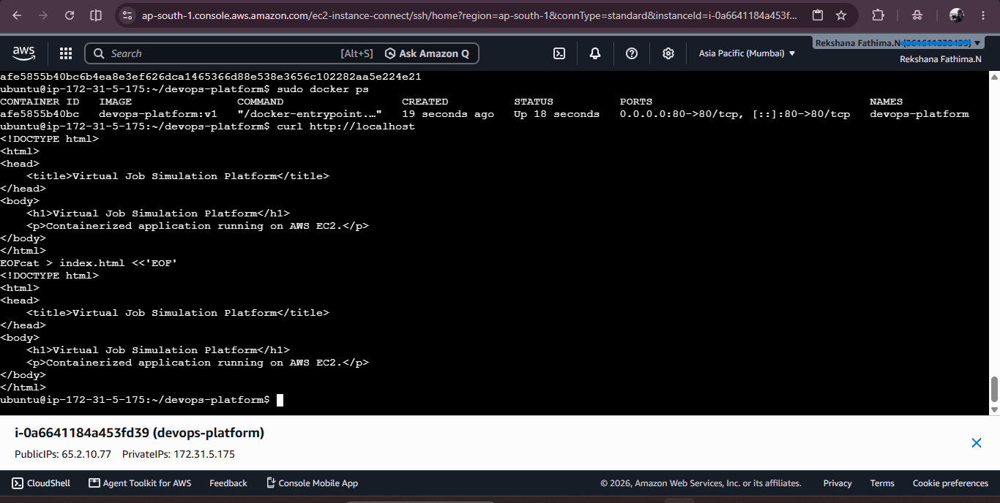

## 8. Application Test

The application was verified after the container deployment.

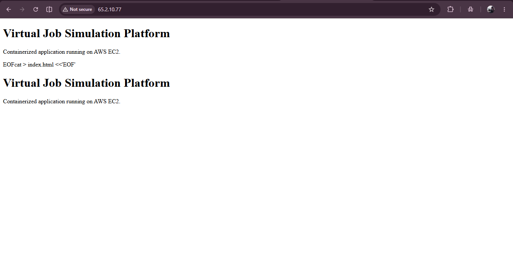

## 9. Docker Version

Docker was verified before proceeding with Kubernetes deployment.

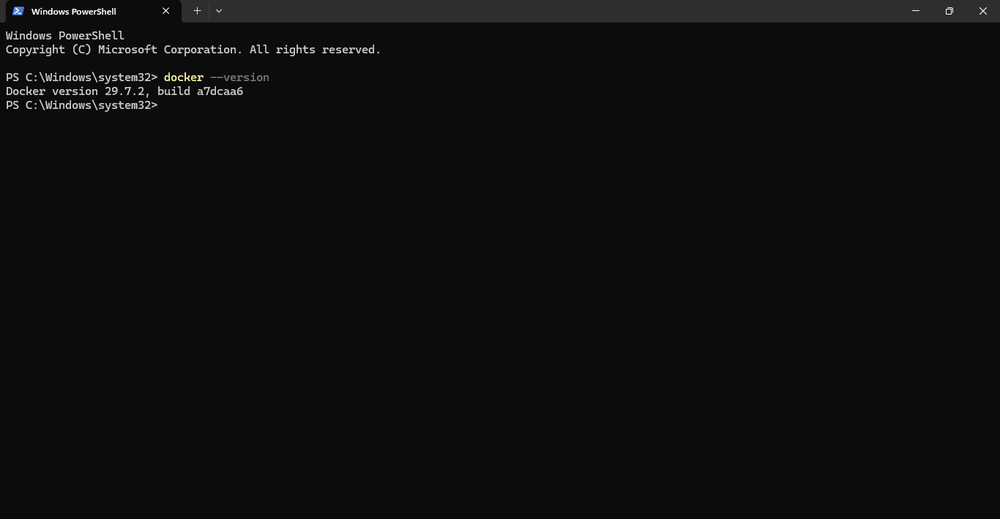

## 10. Docker Information

The Docker environment was inspected to confirm the runtime configuration.

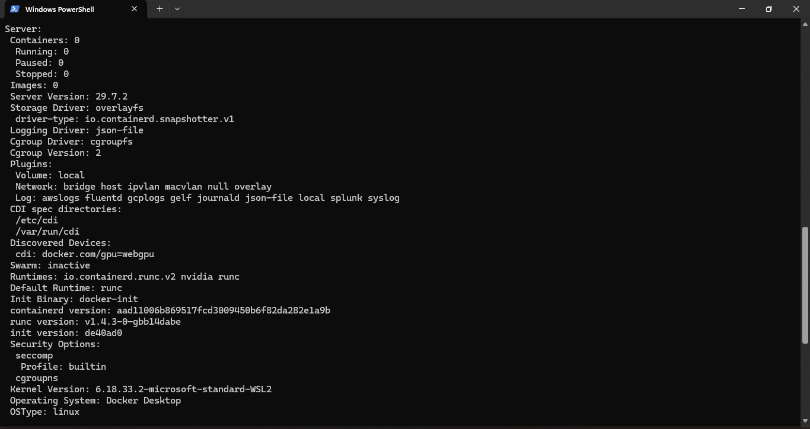

## 11. kubectl Version

The Kubernetes command-line tool was verified.

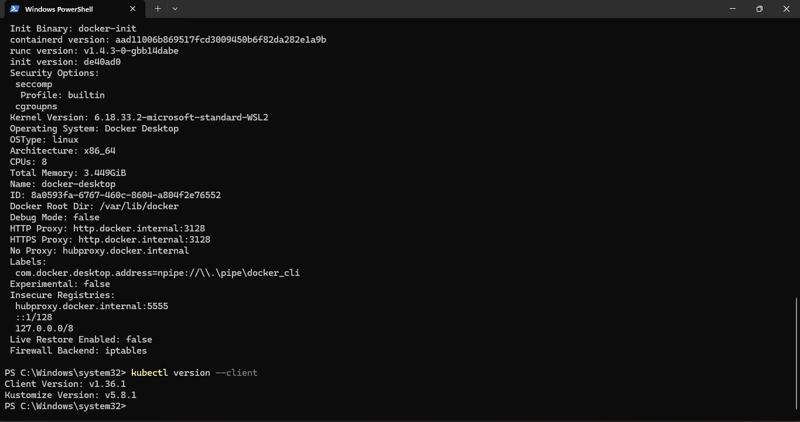

## 12. Minikube Installation

Minikube was installed to provide a local Kubernetes environment.

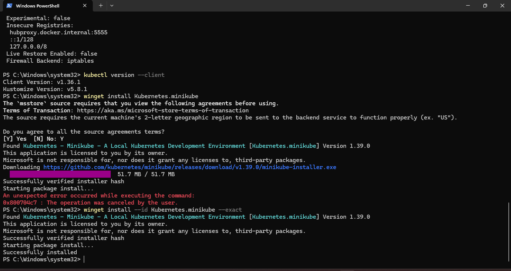

## 13. Minikube Version

The installed Minikube version was verified.

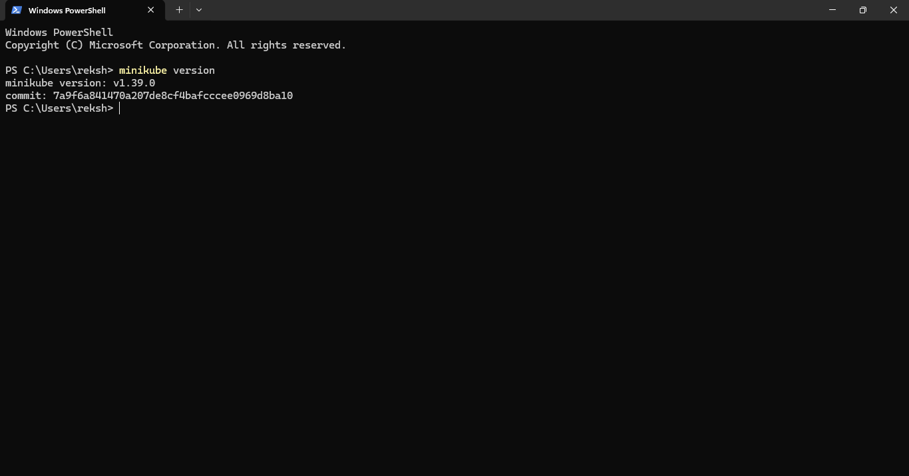

## 14. Minikube Start

The Kubernetes cluster was started successfully using Minikube.

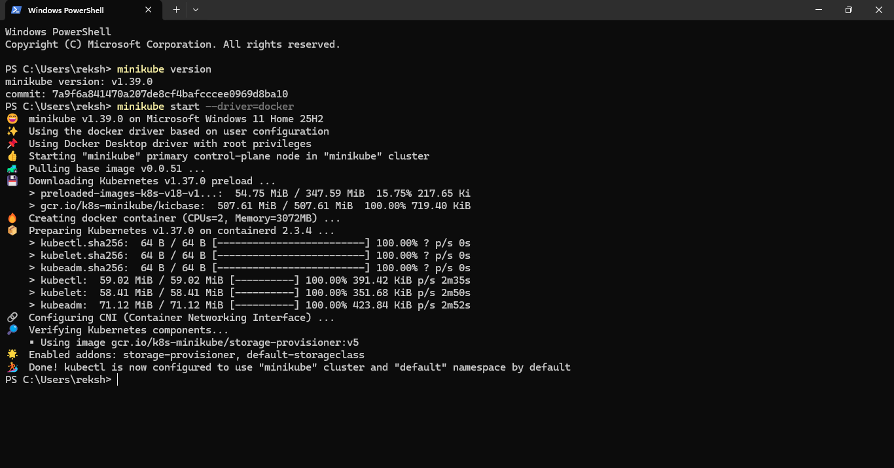
