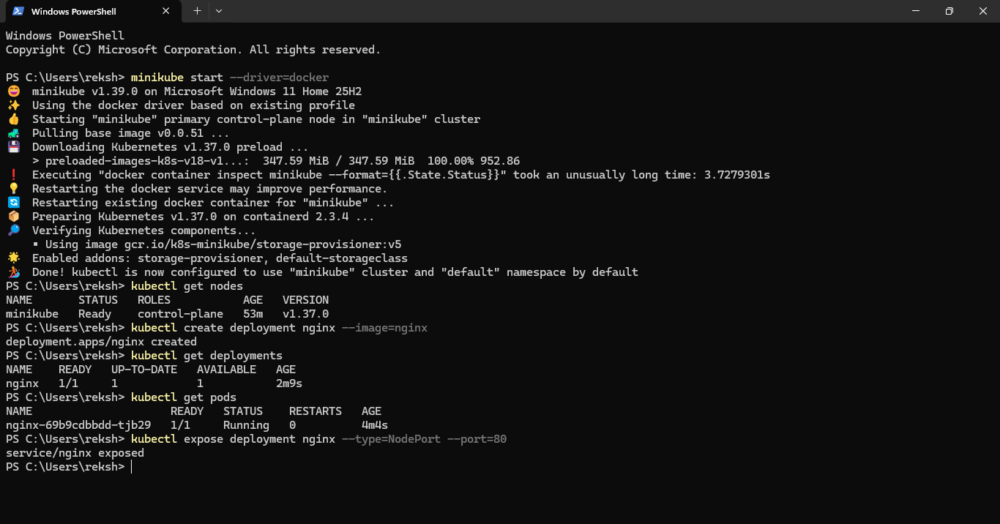
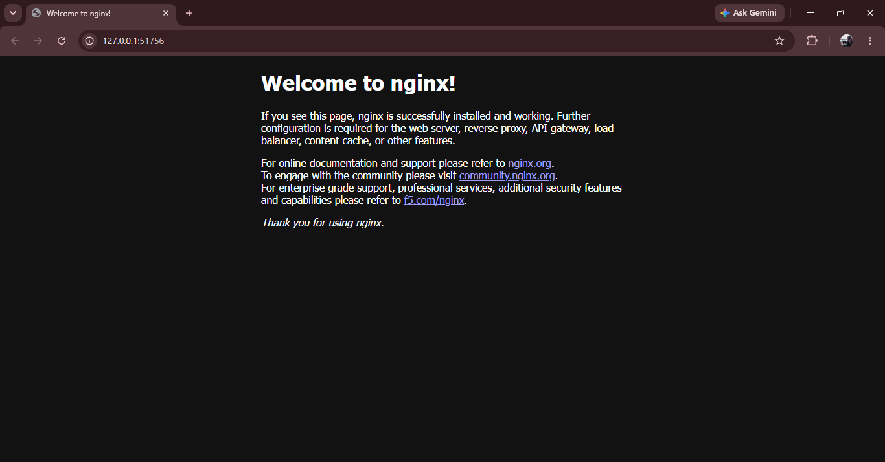

# Kubernetes Deployment

## Kubernetes Cluster

The Kubernetes environment was verified after starting Minikube.

## Application Deployment

NGINX was deployed as the application workload.

## Deployment Approach

The application is managed through Kubernetes resources rather than manually running individual containers.

The basic deployment flow is:

Docker Image
↓
Kubernetes Deployment
↓
Pods
↓
Service
↓
Application Access
