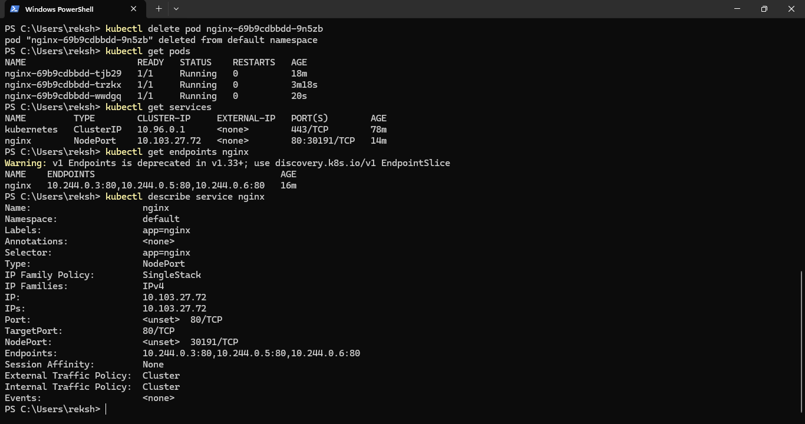
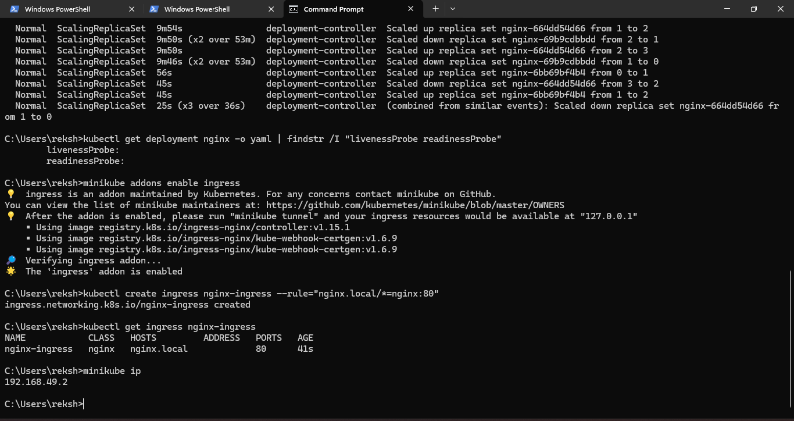

# Network Configuration

## Kubernetes Service

A Kubernetes Service provides stable network access to the application pods.

## Ingress

Ingress provides an application-level entry point and routing mechanism.

## Network Flow

User
↓
Ingress
↓
Service
↓
Application Pods

## Benefits

- Stable service endpoint
- Application routing
- Separation between external access and pods
- Easier traffic management
