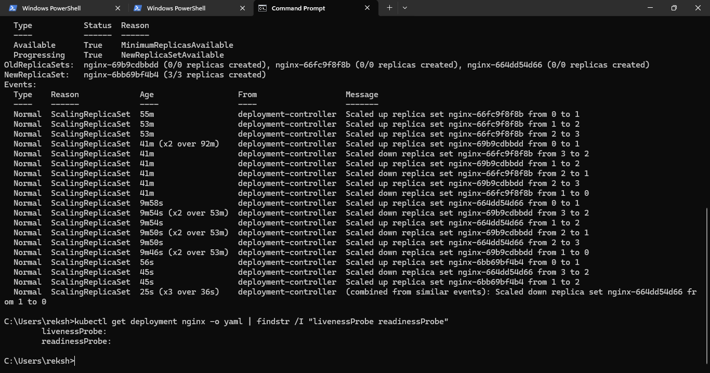

# Health Checks

## Liveness and Readiness Probes

Kubernetes health probes were configured to monitor application health.

## Readiness Probe

The readiness probe determines whether the application is ready to receive traffic.

## Liveness Probe

The liveness probe determines whether the application is healthy enough to continue running.

## Benefits

- Early detection of unhealthy workloads
- Improved availability
- Automatic recovery support
- Safer traffic routing
