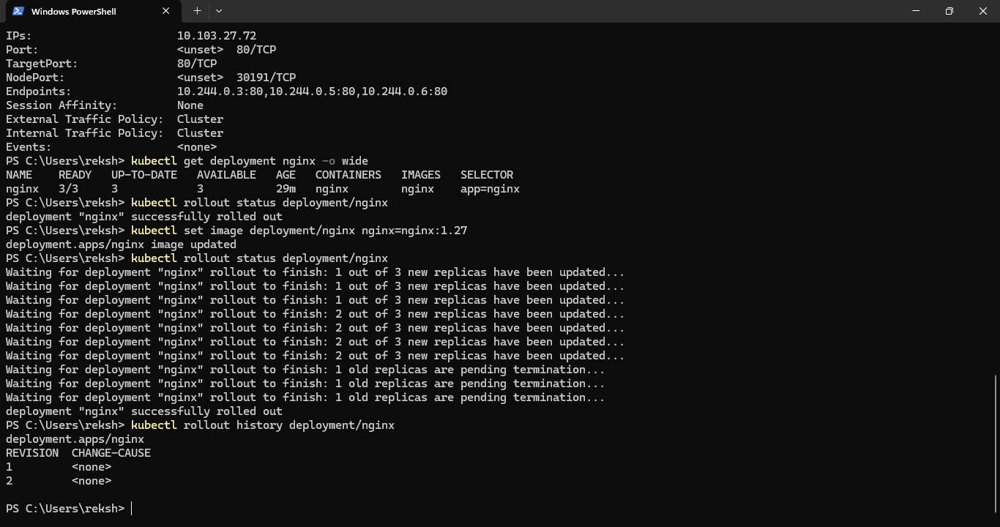

# Rolling Update

## Rolling Update Strategy

A rolling update was performed to demonstrate controlled application version changes.

## Deployment Flow

Old Version
↓
New Version
↓
Rolling Replacement
↓
Health Verification

## Benefits

- Controlled application updates
- Reduced downtime
- Gradual replacement of workloads
- Easier deployment verification
