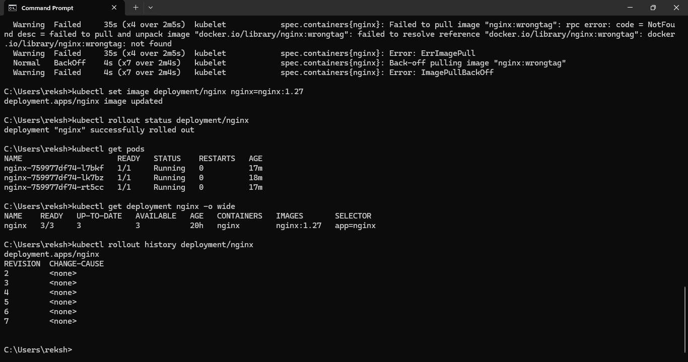
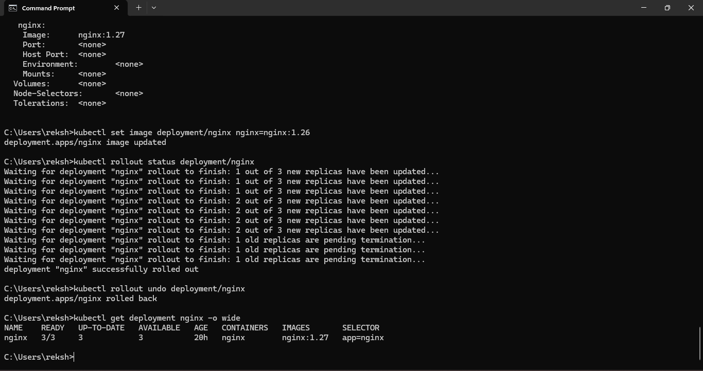

# Rollback and Recovery

## Rollout History

Kubernetes deployment revision history was inspected to track deployment changes.

## Deployment Revision

The deployment revision was verified before recovery operations.

## Rollback

The deployment was rolled back to a previous revision.

## Recovery Strategy

If a deployment introduces an unexpected problem:

1. Check deployment status.
2. Review rollout history.
3. Identify the stable revision.
4. Roll back to the previous revision.
5. Verify application health.
