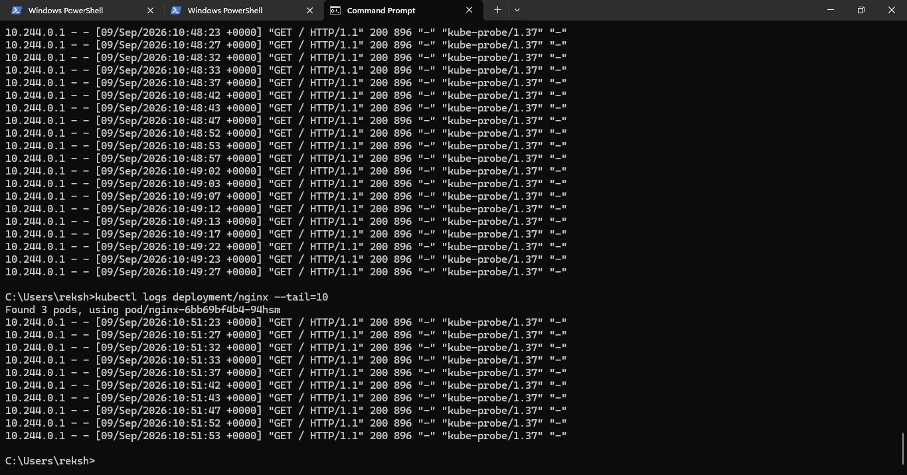
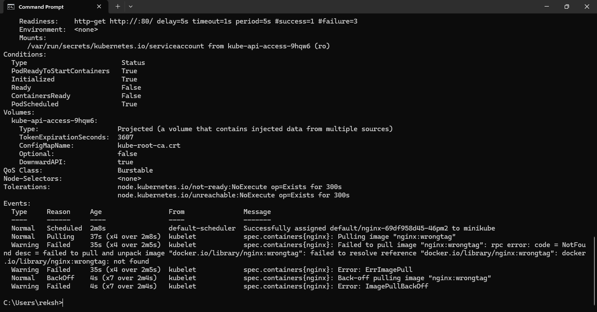

# Testing and Troubleshooting

## Application Testing

The deployed NGINX application was accessed and verified through the browser.


## Kubernetes Logs

Application logs were inspected during troubleshooting.



## Troubleshooting

Kubernetes troubleshooting commands were used to investigate deployment issues.



## Troubleshooting Workflow

Problem
↓
Check Pod Status
↓
Check Logs
↓
Describe Resource
↓
Identify Cause
↓
Apply Fix
↓
Retest

## Common Commands

```bash
kubectl get pods
kubectl describe pod <pod-name>
kubectl logs <pod-name>
kubectl get services
kubectl get deployments
kubectl rollout status deployment/<deployment-name>
