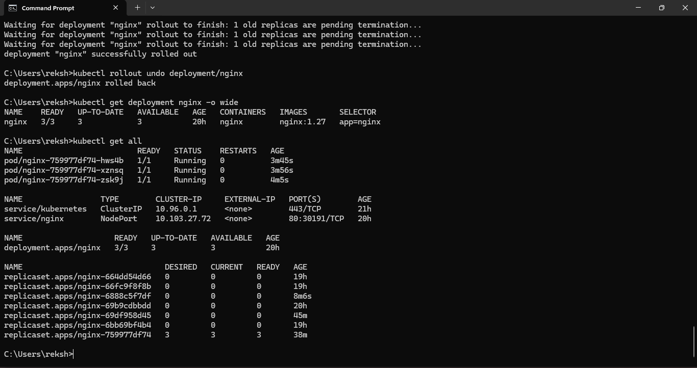

# Deployment Workflow

## Deployment Process

The complete deployment workflow consists of the following stages:

1. Prepare the environment.
2. Install and verify Docker.
3. Install and verify Kubernetes tools.
4. Start the Kubernetes cluster.
5. Prepare the container image.
6. Deploy the application.
7. Verify running pods.
8. Configure the Kubernetes Service.
9. Configure Ingress.
10. Configure ConfigMap and Secret.
11. Configure health probes.
12. Test the application.
13. Scale the application when required.
14. Perform rolling updates.
15. Monitor logs.
16. Troubleshoot deployment issues.
17. Maintain rollout history.
18. Roll back when required.
19. Perform final health verification.

## Final Validation

The final deployment state was verified after completing the deployment and recovery operations.

## Final Result

The containerized application was successfully deployed and tested using Docker and Kubernetes.
